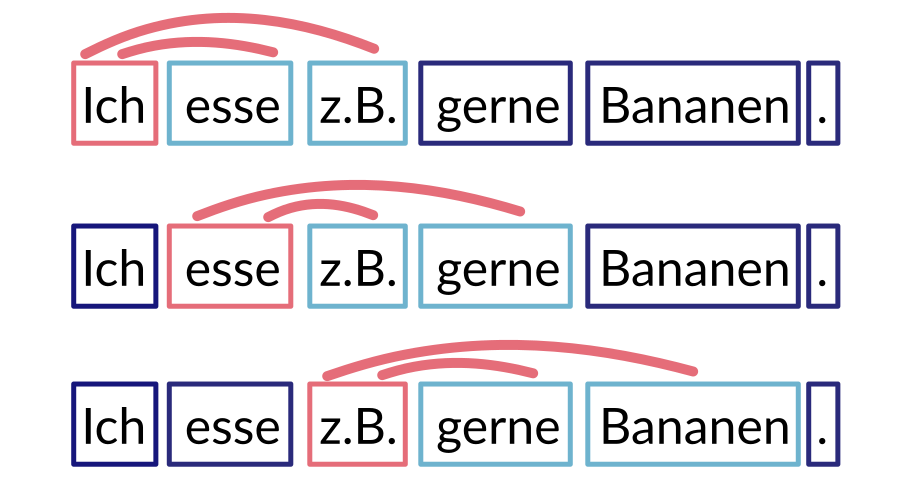

# `hyperhyper` [](https://travis-ci.com/jfilter/hyperhyper) [](https://pypi.org/project/hyperhyper/) [](https://pypi.org/project/hyperhyper/) [](https://pypistats.org/packages/hyperhyper)

`hyperhyper` is a Python package to construct word embeddings for small data.

## Why?

Nowadays, [word embeddings](https://en.wikipedia.org/wiki/Word_embedding) are mostly associated with [Word2vec](https://en.wikipedia.org/wiki/Word2vec) or [fastText](https://en.wikipedia.org/wiki/FastText).
These approaches focus on scenarios, where an abundance of data is available.
And big players such as Facebook provide ready-to-use [pre-trained word embeddings](https://fasttext.cc/docs/en/crawl-vectors.html).
So often you don't have to train new word embeddings from scratch.
But sometimes you do.

Word2vec or fastText require a lot of data – but texts, especially domain-specific texts, may be scarce.
There exist alternative methods based on counting co-locations (word pairs) that require fewer data to work.
This package implements these approaches (somewhat) efficiently.

## Installation

```bash
pip install hyperhyper
```

To enable all features (such as pre-processing with spaCy):

```bash
pip install hyperhyper[full]
```

## Usage

```python
import hyperhyper as hy

# download and uncomproess the data
# wget http://www.statmt.org/wmt14/training-monolingual-news-crawl/news.2010.en.shuffled.gz && gzip -d news.2010.en.shuffled.gz
corpus = hy.Corpus.from_file("news.2010.en.shuffled")
bunch = hy.Bunch("news_bunch", corpus)

# `hyperhyper` is built open `gensim`. So you can get word embeddings in a keyed vectors format.
# https://radimrehurek.com/gensim/models/keyedvectors.html
vectors, results = bunch.svd(keyed_vectors=True)

results["results"][1]
>>> {"name": "en_ws353",
 "score": 0.6510955349164682,
 "oov": 0.014164305949008499,
 "fullscore": 0.641873218557878}

vectors.most_similar("berlin")
>>> [("vienna", 0.6323208808898926),
 ("frankfurt", 0.5965485572814941),
 ("munich", 0.5737138986587524),
 ("amsterdam", 0.5511572360992432),
 ("stockholm", 0.5423270463943481)]
```

Check out the [examples](./examples).

The general concepts:

-   preprocess data once and save them in a `bunch`
-   cache all results and also record their performance on test data
-   make it easy to fine-tune parameters for your data

More documentation may be forthcoming. Until then you have to read the [source code](./hyperhyper).

## Performance Optimization

### Install MKL

If you have an Intel CPU, it's recommended to use [MKL](https://en.wikipedia.org/wiki/Math_Kernel_Library) to speed up numeric executions.
Otherwise, the default [OpenBLAS](https://en.wikipedia.org/wiki/OpenBLAS) will get installed when initially installing `hyperhyper`.

It can be challenging to correctly set up MKL.
A conda package by Intel may help you.

```bash
conda install -c intel intelpython3_core
pip install hyperhyper
```

Verify wheter `mkl_info` is present in the numpy config:

```python
>>> import numpy
>>> numpy.__config__.show()
```

### Disable Numerical Multithreading

Further, disable the internal multithreading ability of MKL or OpenBLAS (numerical libraries).
This speeds up computation because you should do multiprocessing on an outer loop anyhow.
But you can also leave the default to take advantage of all cores for your numerical computations.
[Some Tweets why multithreading with OpenBLAS can cause problems.](https://twitter.com/honnibal/status/1067920534585917440)

```bash
export OPENBLAS_NUM_THREADS=1
export MKL_NUM_THREADS=1
```

## Background

`hyperhyper` is based on research by Omer Levy et al. from 2015 ([the paper](https://aclweb.org/anthology/papers/Q/Q15/Q15-1016/)).
The authors published the code they used in their experiments as [Hyperwods](https://bitbucket.org/omerlevy/hyperwords).
Initially, I [tried](https://github.com/jfilter/hyperwords) to port their original software to Python 3 but I ended up re-writing large parts of it.
So this package was born.




The basic idea: Construct pairs of words that appear together in sentences (within a given window size).
Then do some math magic around matrix operations (PPMI, SVD) to get low-dimensional embeddings.

The count-based word-embeddings by `hyperhyper` are deterministic.
So multiple runs of experiments with identical parameters will yield the same results.
Word2vec and others unstable.
Due to randomness, their results will vary.

`hyperhyper` is built upon the seminal Python NLP package [gensim](https://radimrehurek.com/gensim/).

Limitations: With `hyperhyper` you will run into (memory) problems if you need large vocabularies (set of possible words).
It's fine if you have a vocabulary up until ~ 50k.
Word2vec and fastText especially solve this [curse of dimensionality](https://en.wikipedia.org/wiki/Curse_of_dimensionality).
If you're interested in details you should read the aforementioned excellent [paper by Omer Levy et al.](https://aclweb.org/anthology/papers/Q/Q15/Q15-1016/).

### Scientific Literature

This software is based on ideas stemming from the following papers:

-   Improving Distributional Similarity with Lessons Learned from Word Embeddings, Omer Levy, Yoav Goldberg, Ido Dagan, TACL 2015. [Paper](https://aclweb.org/anthology/papers/Q/Q15/Q15-1016/) [Code](https://bitbucket.org/omerlevy/hyperwords)
    > Recent trends suggest that neural-network-inspired word embedding models outperform traditional count-based distributional models on word similarity and analogy detection tasks. We reveal that much of the performance gains of word embeddings are due to certain system design choices and hyperparameter optimizations, rather than the embedding algorithms themselves. Furthermore, we show that these modifications can be transferred to traditional distributional models, yielding similar gains. In contrast to prior reports, we observe mostly local or insignificant performance differences between the methods, with no global advantage to any single approach over the others.
-   The Influence of Down-Sampling Strategies on SVD Word Embedding Stability, Johannes Hellrich, Bernd Kampe, Udo Hahn, NAACL 2019. [Paper](https://aclweb.org/anthology/papers/W/W19/W19-2003/) [Code](https://github.com/hellrich/hyperwords) [Code](https://github.com/hellrich/embedding_downsampling_comparison)
    > The stability of word embedding algorithms, i.e., the consistency of the word representations they reveal when trained repeatedly on the same data set, has recently raised concerns. We here compare word embedding algorithms on three corpora of different sizes, and evaluate both their stability and accuracy. We find strong evidence that down-sampling strategies (used as part of their training procedures) are particularly influential for the stability of SVD-PPMI-type embeddings. This finding seems to explain diverging reports on their stability and lead us to a simple modification which provides superior stability as well as accuracy on par with skip-gram embedding

## Development

Install and use [poetry](https://python-poetry.org/).

## Contributing

If you have a **question**, found a **bug** or want to propose a new **feature**, have a look at the [issues page](https://github.com/jfilter/hyperhyper/issues).

**Pull requests** are especially welcomed when they fix bugs or improve the code quality.

## Future Work / TODO

-   evaluation for analogies
-   implement counting in a more efficient programming language, e.g. Cython.

## `hyperhyper`?

[](https://www.youtube.com/watch?v=7Twnmhe948A "Scooter – Hyper Hyper")

## Acknowledgments

Building upon the work by Omer Levy et al. for [Hyperwords](https://bitbucket.org/omerlevy/hyperwords).

## License

BSD-2-Clause

## Sponsoring

This work was created as part of a [project](https://github.com/jfilter/ptf) that was funded by the German [Federal Ministry of Education and Research](https://www.bmbf.de/en/index.html).


